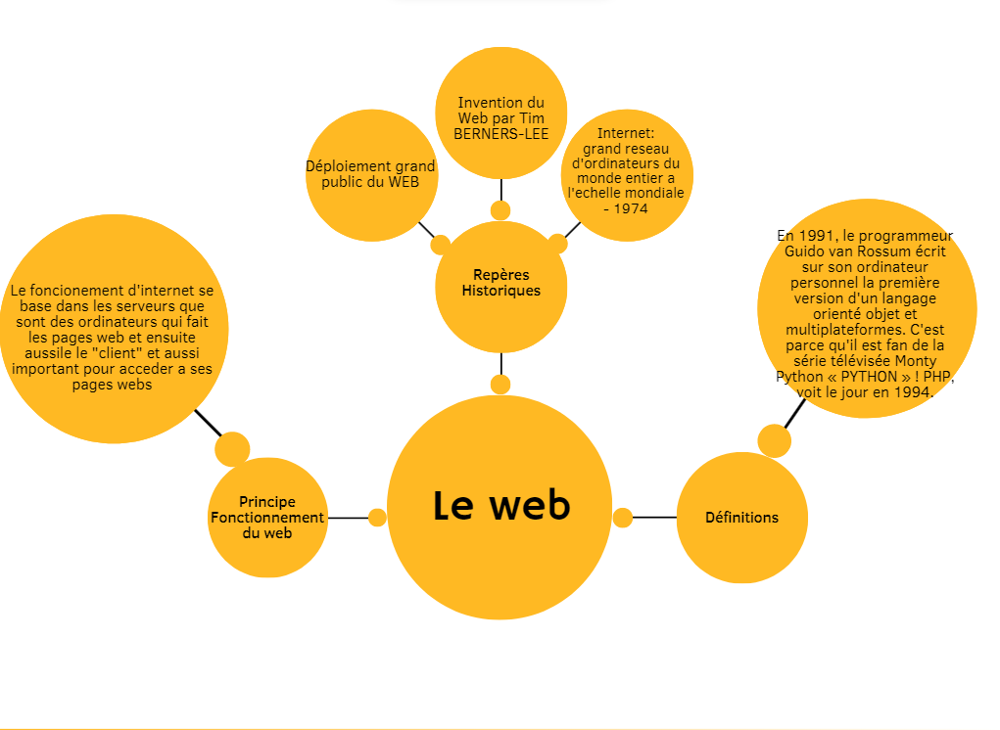

<html>
	<head>
		<meta charset="uft-8" />
		<link rel="stylesheet" href="style6.css">
		<h1>
3eme Chapitre: Le Web.
</h1>
	</head>
	<body>
			<h2>Activite faite en classe:</h2>
			<li>On a fait une carte mentale sur le Web en Cavana:</li>
			 
			
	</body>
</html>
